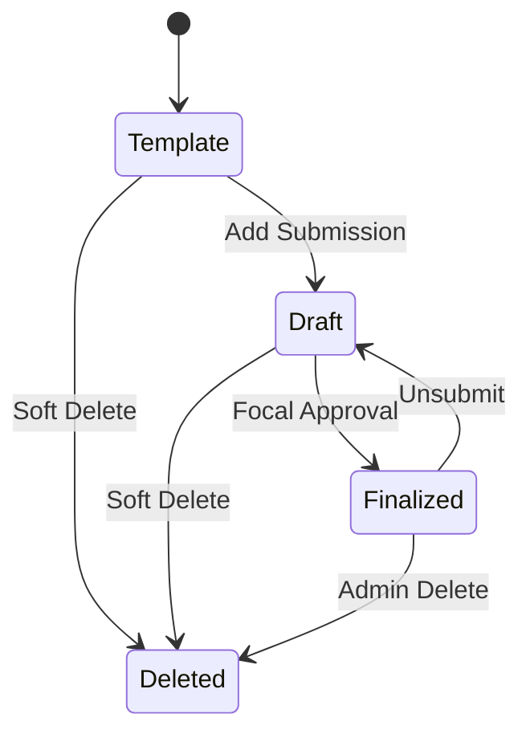
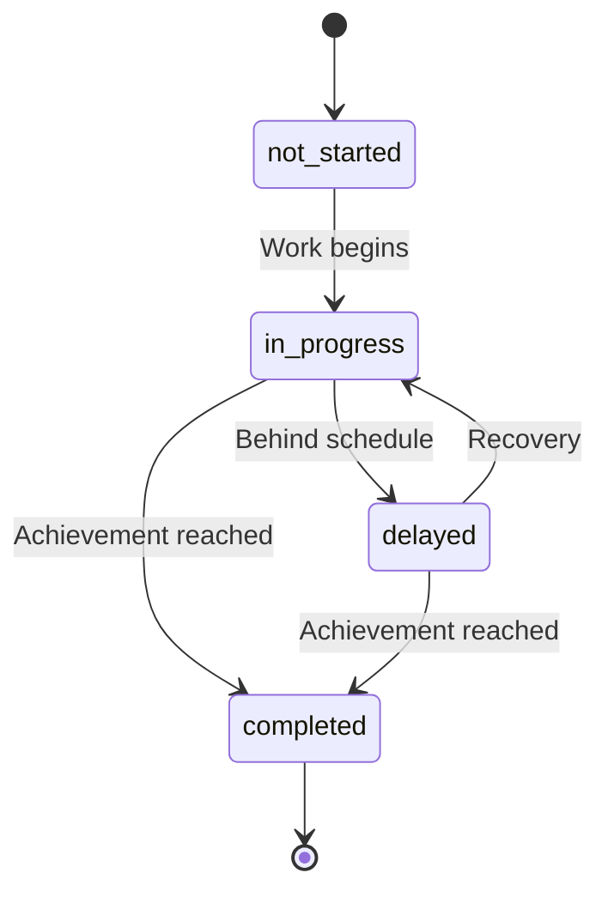
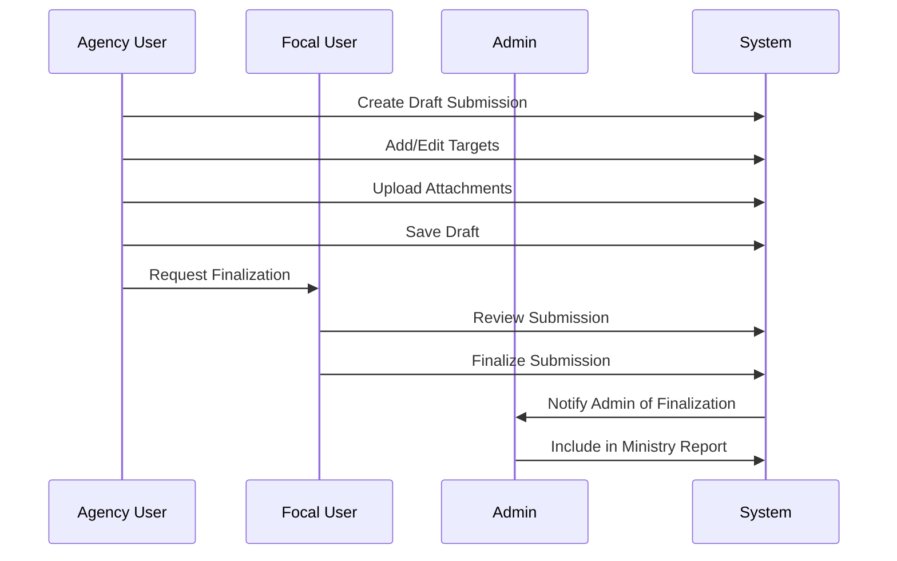
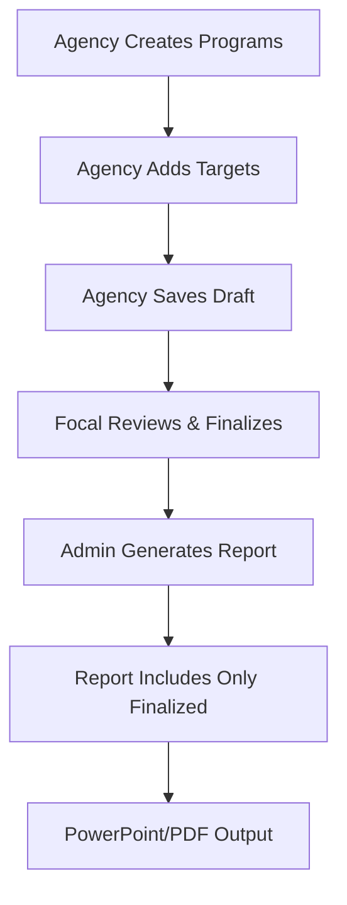

# PCDS 2030 Dashboard - Business Logic Documentation

## Overview

The PCDS 2030 Dashboard implements complex business logic for forestry sector program management, quarterly reporting, and ministry-level oversight. This document details all core business rules, workflows, and state management systems.

## Core Business Entities

### Entity Hierarchy
```
Ministry of Natural Resources & Urban Development
├── Agencies (SFC, STIDC, FDS)
│   ├── Users (Admin, Focal, Agency)
│   ├── Programs
│   │   ├── Submissions (Quarterly)
│   │   │   └── Targets
│   │   └── Attachments
│   └── Reports
└── Reporting Periods (Quarterly/Half-yearly/Yearly)
```

## 1. Program Lifecycle Management

### Program Creation Workflows

#### A. Simple Program Creation
```php
function create_simple_program($data) {
    // Creates program template without submissions
    // Used for basic program registration
    // No initial targets or reporting requirements
}
```

**Use Cases**:
- Quick program registration
- Template creation for future development
- Placeholder programs for planning

#### B. Wizard Program Creation
```php
function create_wizard_program_draft($data) {
    // Creates comprehensive program with:
    // - Initial submission for current period
    // - Target definitions
    // - Assignment setup
}
```

**Use Cases**:
- Full program implementation
- Immediate reporting requirements
- Complex program structures

#### C. Agency Program Creation
```php
function create_agency_program($data) {
    // Standard agency program workflow
    // Includes permission assignments
    // Auto-generates program numbers
}
```

### Program States and Transitions



#### State Definitions

| State | Description | Database Values | Permissions |
|-------|-------------|-----------------|-------------|
| **Template** | Program exists, no submissions | No submissions | Agency can edit |
| **Draft** | Has draft submissions | `is_draft=1, is_submitted=0` | Agency can edit |
| **Finalized** | Submissions submitted | `is_draft=0, is_submitted=1` | Focal/Admin only |
| **Deleted** | Soft deleted | `is_deleted=1` | Admin recovery |

### Program Number Management

#### Numbering System
```php
// Hierarchical format: Initiative.Sequence
'30.1'    // Initiative 30, Program 1
'30.1A'   // Initiative 30, Program 1A  
'30.1A.3' // Initiative 30, Program 1A, Sub-program 3
```

#### Auto-Generation Logic
```php
function generate_next_program_number($initiative_id) {
    // 1. Find highest program number for initiative
    // 2. Parse numeric/alpha sequences
    // 3. Increment appropriately
    // 4. Validate uniqueness
    // 5. Return formatted number
}
```

**Business Rules**:
- Numbers are unique within agency
- Format follows initiative hierarchy
- Alpha sequences: A, B, C... AA, AB, AC...
- Numeric sequences: 1, 2, 3... 10, 11, 12...

## 2. Target Management System

### Target Number Format
```php
// Pattern: {initiative}.{program}.{target}
'30.1A.1'  // Initiative 30, Program 1A, Target 1
'30.1A.2'  // Initiative 30, Program 1A, Target 2
```

### Target State Machine



### Target Business Logic

#### Achievement Tracking
```php
class TargetAchievement {
    public function calculateProgress($target_value, $achievement_value) {
        if ($target_value <= 0) return 0;
        return min(100, ($achievement_value / $target_value) * 100);
    }
    
    public function determineStatus($progress, $period_progress) {
        if ($progress >= 100) return 'completed';
        if ($progress < $period_progress * 0.8) return 'delayed';
        return 'in_progress';
    }
}
```

#### Cross-Period Target Management
- **No Automatic Carry-over**: Each period requires manual target creation
- **Historical Preservation**: All target data preserved across periods
- **Status Evolution**: Target status can change between periods
- **Number Consistency**: Target numbers maintained for tracking

## 3. Reporting Period Management

### Period Types and Validation

```php
// Period type definitions
PERIOD_TYPES = [
    'quarter' => ['min' => 1, 'max' => 4],    // Q1, Q2, Q3, Q4
    'half'    => ['min' => 1, 'max' => 2],    // H1, H2
    'yearly'  => ['min' => 1, 'max' => 1]     // Annual
];
```

### Auto-Management Logic

```php
function auto_manage_reporting_periods() {
    $current_date = new DateTime();
    $current_year = $current_date->format('Y');
    
    // 1. Create missing quarters for current year
    create_missing_quarters($current_year);
    
    // 2. Open next year Q1 starting October
    if ($current_date->format('n') >= 10) {
        create_missing_quarters($current_year + 1);
    }
    
    // 3. Update period statuses based on current date
    update_period_statuses($current_date);
}
```

### Period Status Management

#### Status Rules
```php
function determine_period_status($period, $current_date) {
    $start_date = new DateTime($period['start_date']);
    $end_date = new DateTime($period['end_date']);
    
    if ($current_date >= $start_date && $current_date <= $end_date) {
        return 'open';
    }
    
    return 'closed';
}
```

#### Admin Override Capability
- Admins can manually open/close periods
- Override flags prevent auto-management
- Emergency period adjustments supported

## 4. Rating and Status System

### Rating Definitions

```php
const RATINGS = [
    'not_started' => [
        'label' => 'Not Started',
        'color' => '#6c757d',
        'badge' => 'secondary'
    ],
    'on_track_for_year' => [
        'label' => 'On Track',
        'color' => '#28a745',
        'badge' => 'success'
    ],
    'monthly_target_achieved' => [
        'label' => 'Target Achieved',
        'color' => '#007bff',
        'badge' => 'primary'
    ],
    'severe_delay' => [
        'label' => 'Severe Delay',
        'color' => '#dc3545',
        'badge' => 'danger'
    ]
];
```

### Rating Business Logic

#### Validation Rules
```php
function is_valid_rating($rating) {
    return in_array($rating, [
        'not_started',
        'on_track_for_year', 
        'monthly_target_achieved',
        'severe_delay'
    ]);
}
```

#### Legacy Rating Conversion
```php
function convert_legacy_rating($old_rating) {
    $conversion_map = [
        'green' => 'monthly_target_achieved',
        'yellow' => 'on_track_for_year',
        'red' => 'severe_delay',
        'grey' => 'not_started'
    ];
    
    return $conversion_map[$old_rating] ?? 'not_started';
}
```

### Program Status vs Rating

| Field | Purpose | Values | Updated By |
|-------|---------|--------|------------|
| **status** | Operational state | active, on_hold, completed, delayed, cancelled | Agency users |
| **rating** | Performance assessment | not_started, on_track, achieved, delayed | For reporting |

## 5. Submission Workflow

### Submission Lifecycle



### Submission State Management

```php
class SubmissionWorkflow {
    public function createDraft($program_id, $period_id, $user_id) {
        // 1. Validate program ownership
        // 2. Check period status
        // 3. Create submission record
        // 4. Set initial state: is_draft=1, is_submitted=0
        // 5. Log audit trail
    }
    
    public function finalizeSubmission($submission_id, $focal_user_id) {
        // 1. Validate focal permissions
        // 2. Validate submission completeness
        // 3. Update state: is_draft=0, is_submitted=1
        // 4. Set submitted_by and submitted_at
        // 5. Send notifications
        // 6. Log audit trail
    }
    
    public function unsubmitSubmission($submission_id, $focal_user_id) {
        // 1. Validate focal permissions
        // 2. Update state: is_draft=1, is_submitted=0
        // 3. Clear submitted_by and submitted_at
        // 4. Send notifications
        // 5. Log audit trail
    }
}
```

### Validation Rules

#### Submission Validation
```php
function validate_submission_for_finalization($submission_id) {
    $validation_errors = [];
    
    // Check targets exist
    if (count_submission_targets($submission_id) === 0) {
        $validation_errors[] = 'At least one target is required';
    }
    
    // Check target completeness
    $incomplete_targets = get_incomplete_targets($submission_id);
    if (!empty($incomplete_targets)) {
        $validation_errors[] = 'All targets must have descriptions and values';
    }
    
    // Check period is open
    if (!is_period_open($period_id)) {
        $validation_errors[] = 'Cannot finalize submission for closed period';
    }
    
    return $validation_errors;
}
```

## 6. Audit System

### Comprehensive Audit Trail

```php
class AuditLogger {
    public function logAction($user_id, $action, $table_name, $record_id, $details = []) {
        // Main audit log entry
        $audit_log_id = $this->insertAuditLog([
            'user_id' => $user_id,
            'action' => $action,
            'table_name' => $table_name,
            'record_id' => $record_id,
            'ip_address' => get_client_ip(),
            'user_agent' => $_SERVER['HTTP_USER_AGENT'] ?? '',
            'details' => json_encode($details)
        ]);
        
        // Field-level changes
        if (isset($details['field_changes'])) {
            $this->logFieldChanges($audit_log_id, $details['field_changes']);
        }
    }
    
    private function logFieldChanges($audit_log_id, $changes) {
        foreach ($changes as $field => $change) {
            $this->insertFieldChange([
                'audit_log_id' => $audit_log_id,
                'field_name' => $field,
                'old_value' => $change['old'] ?? null,
                'new_value' => $change['new'] ?? null,
                'change_type' => $this->determineChangeType($change)
            ]);
        }
    }
}
```

### Audit Events

| Event Type | Trigger | Data Captured |
|------------|---------|---------------|
| **User Actions** | Login/logout | IP, user agent, timestamp |
| **Data Changes** | CRUD operations | Before/after values, field changes |
| **System Events** | Automated processes | Process details, affected records |
| **File Operations** | Upload/download | File metadata, user actions |

### Audit Cleanup

```php
function cleanup_audit_logs($retention_days = 365) {
    // 1. Calculate cutoff date
    // 2. Archive old logs to backup storage
    // 3. Delete logs older than retention period
    // 4. Maintain referential integrity
    // 5. Log cleanup operation
}
```

## 7. File Management System

### Upload Architecture

```php
class FileUploadManager {
    private $upload_base_path = PROJECT_ROOT_PATH . 'uploads/programs/attachments/';
    
    public function uploadAttachment($program_id, $submission_id, $file) {
        // 1. Validate file type and size
        $validation = $this->validateFile($file);
        if (!$validation['valid']) {
            throw new Exception($validation['error']);
        }
        
        // 2. Generate unique filename
        $filename = $this->generateUniqueFilename($file['name']);
        
        // 3. Create directory structure
        $upload_dir = $this->createUploadDirectory($submission_id);
        
        // 4. Move uploaded file
        $file_path = $upload_dir . $filename;
        if (!move_uploaded_file($file['tmp_name'], $file_path)) {
            throw new Exception('Failed to save file');
        }
        
        // 5. Save metadata to database
        return $this->saveAttachmentRecord($program_id, $submission_id, $file, $filename);
    }
    
    private function validateFile($file) {
        $allowed_types = ['pdf', 'doc', 'docx', 'xls', 'xlsx', 'jpg', 'png'];
        $max_size = 10 * 1024 * 1024; // 10MB
        
        // Check file extension
        $extension = strtolower(pathinfo($file['name'], PATHINFO_EXTENSION));
        if (!in_array($extension, $allowed_types)) {
            return ['valid' => false, 'error' => 'File type not allowed'];
        }
        
        // Check file size
        if ($file['size'] > $max_size) {
            return ['valid' => false, 'error' => 'File too large'];
        }
        
        return ['valid' => true];
    }
}
```

### File Security

#### Security Measures
```php
// Path validation to prevent directory traversal
function sanitize_filename($filename) {
    $filename = basename($filename);
    $filename = preg_replace('/[^a-zA-Z0-9._-]/', '_', $filename);
    return $filename;
}

// Duplicate prevention
function check_file_exists($submission_id, $filename) {
    return file_exists($this->getUploadPath($submission_id) . $filename);
}

// Access control
function can_access_attachment($attachment_id, $user_id) {
    // Check if user has access to the program/submission
    // Verify agency membership or admin privileges
}
```

## 8. Notification System

### Notification Triggers and Recipients

```php
class NotificationManager {
    public function sendProgramNotification($action, $program_id, $actor_user_id) {
        $program = get_program($program_id);
        $recipients = $this->determineRecipients($program, $actor_user_id);
        
        foreach ($recipients as $recipient) {
            $message = $this->generateMessage($action, $program, $recipient['role']);
            $this->createNotification($recipient['user_id'], $message);
        }
    }
    
    private function determineRecipients($program, $exclude_user_id) {
        $recipients = [];
        
        // Agency users (if program allows)
        if (!$program['restrict_editors']) {
            $recipients = array_merge($recipients, 
                get_agency_users($program['agency_id'])
            );
        } else {
            $recipients = array_merge($recipients,
                get_assigned_program_users($program['program_id'])
            );
        }
        
        // Always include focal users and admins
        $recipients = array_merge($recipients,
            get_focal_users($program['agency_id']),
            get_admin_users()
        );
        
        // Exclude the action initiator
        return array_filter($recipients, function($user) use ($exclude_user_id) {
            return $user['user_id'] !== $exclude_user_id;
        });
    }
}
```

### Notification Types

| Type | Trigger | Recipients | Content |
|------|---------|------------|---------|
| **Program Created** | New program | Agency users, focals, admins | Program details, creator |
| **Submission Finalized** | Focal approval | Admins, agency users | Period, program, submission |
| **Target Updated** | Target changes | Program assignees | Target details, changes |
| **Assignment Changed** | User permissions | Affected users | Permission changes |
| **Period Opened** | Admin action | All users | New period details |

## 9. Report Generation

### Report Business Logic

```php
class ReportGenerator {
    public function generateMinistryReport($period_id, $options = []) {
        // 1. Validate period and permissions
        $period = get_reporting_period($period_id);
        if (!$period || !is_admin()) {
            throw new Exception('Unauthorized or invalid period');
        }
        
        // 2. Collect data based on finalized submissions
        $report_data = [
            'period_info' => $period,
            'agency_summaries' => $this->getAgencySummaries($period_id),
            'program_details' => $this->getProgramDetails($period_id, $options),
            'outcomes_data' => $this->getOutcomesData($period_id),
            'statistical_overview' => $this->getStatisticalOverview($period_id)
        ];
        
        // 3. Apply filters and selections
        if (isset($options['selected_programs'])) {
            $report_data['program_details'] = array_filter(
                $report_data['program_details'],
                fn($p) => in_array($p['program_id'], $options['selected_programs'])
            );
        }
        
        // 4. Generate report file
        return $this->generateReportFile($report_data, $options['format'] ?? 'pptx');
    }
    
    private function getProgramDetails($period_id, $options) {
        // Only include finalized submissions
        $query = "
            SELECT p.*, ps.*, pt.*
            FROM programs p
            JOIN program_submissions ps ON p.program_id = ps.program_id
            LEFT JOIN program_targets pt ON ps.submission_id = pt.submission_id
            WHERE ps.period_id = ? 
              AND ps.is_submitted = 1 
              AND ps.is_deleted = 0
              AND p.is_deleted = 0
            ORDER BY p.agency_id, p.program_name
        ";
        
        return execute_query($query, [$period_id]);
    }
}
```

### Report Data Flow



## Business Rule Summary

### Core Principles
1. **Hierarchical Data**: Initiative → Program → Submission → Target
2. **Period-Based Reporting**: All data organized by reporting periods
3. **Role-Based Permissions**: Admin → Focal → Agency user hierarchy
4. **Audit Everything**: Complete change tracking for compliance
5. **Soft Deletion**: Data preservation for historical analysis
6. **State Machine Logic**: Clear workflows with defined transitions
7. **Validation at Every Step**: Data integrity and business rule enforcement

### Critical Business Rules
1. **Only finalized submissions appear in ministry reports**
2. **Focal users must approve all submissions before ministry visibility**
3. **Target numbers follow hierarchical program numbering**
4. **Periods auto-open based on calendar dates**
5. **Agency users can only access their own agency's data**
6. **All data changes are audited with user attribution**
7. **File uploads are validated and securely stored**
8. **Notifications ensure stakeholder awareness of changes**

This comprehensive business logic ensures compliance with government reporting requirements while providing flexibility for program management and tracking.