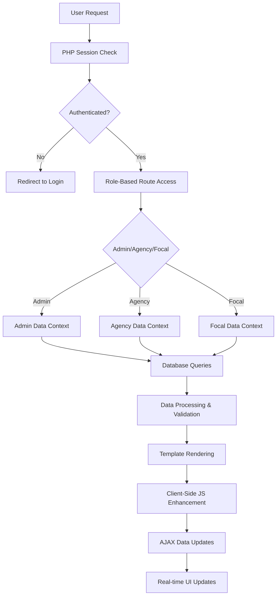

# PCDS 2030 Dashboard - Data Flow Documentation

## Overview

The PCDS 2030 Dashboard implements a complex data flow system that manages forestry sector reporting data across multiple agencies, users, and reporting periods. This document details the current PHP-based data flow patterns and provides migration strategies for React/Vite implementation.

## Current Data Flow Architecture

### High-Level Data Flow



## 1. Authentication & Session Data Flow

### Current PHP Session Flow

```php
// Session initialization and management
session_start();

// Authentication flow
function authenticate_user($username, $password) {
    // 1. Validate credentials against database
    $user = verify_user_credentials($username, $password);
    
    if ($user) {
        // 2. Set session variables
        $_SESSION['user_id'] = $user['user_id'];
        $_SESSION['username'] = $user['username'];
        $_SESSION['role'] = $user['role'];
        $_SESSION['agency_id'] = $user['agency_id'];
        $_SESSION['fullname'] = $user['fullname'];
        
        // 3. Log authentication event
        log_audit_event('login_success', $user['user_id']);
        
        return true;
    }
    
    return false;
}

// Data context based on role
function get_user_data_context() {
    if (is_admin()) {
        return [
            'scope' => 'all_agencies',
            'programs' => get_all_programs(),
            'users' => get_all_users(),
            'permissions' => ['create', 'read', 'update', 'delete']
        ];
    } elseif (is_focal()) {
        return [
            'scope' => 'agency_level',
            'agency_id' => $_SESSION['agency_id'],
            'programs' => get_agency_programs($_SESSION['agency_id']),
            'permissions' => ['read', 'update', 'finalize']
        ];
    } else {
        return [
            'scope' => 'user_level',
            'agency_id' => $_SESSION['agency_id'],
            'programs' => get_user_assigned_programs($_SESSION['user_id']),
            'permissions' => ['read', 'update']
        ];
    }
}
```

### React Authentication Migration Pattern

```typescript
// Authentication context with TypeScript
interface AuthState {
  user: User | null;
  isAuthenticated: boolean;
  isLoading: boolean;
  permissions: Permission[];
}

interface AuthContextType extends AuthState {
  login: (credentials: LoginCredentials) => Promise<void>;
  logout: () => void;
  refreshToken: () => Promise<void>;
}

export const AuthProvider: React.FC<{ children: React.ReactNode }> = ({ children }) => {
  const [state, setState] = useState<AuthState>({
    user: null,
    isAuthenticated: false,
    isLoading: true,
    permissions: []
  });

  useEffect(() => {
    // Initialize auth state from localStorage/sessionStorage
    const initializeAuth = async () => {
      const token = localStorage.getItem('auth_token');
      if (token) {
        try {
          const user = await validateToken(token);
          setState({
            user,
            isAuthenticated: true,
            isLoading: false,
            permissions: calculatePermissions(user)
          });
        } catch (error) {
          localStorage.removeItem('auth_token');
          setState(prev => ({ ...prev, isLoading: false }));
        }
      } else {
        setState(prev => ({ ...prev, isLoading: false }));
      }
    };

    initializeAuth();
  }, []);

  const login = async (credentials: LoginCredentials) => {
    const response = await api.post('/auth/login', credentials);
    const { token, user } = response.data;
    
    localStorage.setItem('auth_token', token);
    setState({
      user,
      isAuthenticated: true,
      isLoading: false,
      permissions: calculatePermissions(user)
    });
  };

  return (
    <AuthContext.Provider value={{ ...state, login, logout, refreshToken }}>
      {children}
    </AuthContext.Provider>
  );
};
```

## 2. Data Fetching Patterns

### Current PHP Data Loading

```php
// Dashboard data aggregation
function load_dashboard_data($user_context) {
    $data = [];
    
    // 1. Get current reporting period
    $current_period = get_current_reporting_period();
    $data['current_period'] = $current_period;
    
    // 2. Load programs based on user context
    if ($user_context['scope'] === 'all_agencies') {
        $data['programs'] = get_all_programs_with_submissions($current_period['period_id']);
        $data['agencies'] = get_all_agencies();
    } else {
        $data['programs'] = get_agency_programs_with_submissions(
            $user_context['agency_id'], 
            $current_period['period_id']
        );
    }
    
    // 3. Calculate statistics
    $data['stats'] = calculate_dashboard_statistics($data['programs']);
    
    // 4. Get recent activities
    $data['recent_activities'] = get_recent_activities($user_context);
    
    // 5. Load notifications
    $data['notifications'] = get_user_notifications($_SESSION['user_id']);
    
    return $data;
}

// Individual data fetchers
function get_program_with_submissions($program_id, $period_id = null) {
    global $conn;
    
    $query = "
        SELECT p.*, ps.*, pt.*
        FROM programs p
        LEFT JOIN program_submissions ps ON p.program_id = ps.program_id
        LEFT JOIN program_targets pt ON ps.submission_id = pt.submission_id
        WHERE p.program_id = ? AND p.is_deleted = 0
    ";
    
    $params = [$program_id];
    
    if ($period_id) {
        $query .= " AND ps.period_id = ?";
        $params[] = $period_id;
    }
    
    $stmt = $conn->prepare($query);
    $stmt->bind_param(str_repeat('i', count($params)), ...$params);
    $stmt->execute();
    
    return $stmt->get_result()->fetch_all(MYSQLI_ASSOC);
}
```

### React Query Data Fetching Migration

```typescript
// React Query setup for data fetching
import { useQuery, useMutation, useQueryClient } from '@tanstack/react-query';

// Query keys factory
export const queryKeys = {
  all: ['pcds'] as const,
  periods: () => [...queryKeys.all, 'periods'] as const,
  period: (id: number) => [...queryKeys.periods(), id] as const,
  programs: () => [...queryKeys.all, 'programs'] as const,
  program: (id: number) => [...queryKeys.programs(), id] as const,
  programSubmissions: (programId: number, periodId?: number) => 
    [...queryKeys.program(programId), 'submissions', periodId] as const,
  dashboardData: (periodId?: number) => 
    [...queryKeys.all, 'dashboard', periodId] as const,
  notifications: () => [...queryKeys.all, 'notifications'] as const,
};

// Dashboard data hook
export const useDashboardData = (periodId?: number) => {
  const { user } = useAuth();
  
  return useQuery({
    queryKey: queryKeys.dashboardData(periodId),
    queryFn: async () => {
      const params = new URLSearchParams();
      if (periodId) params.append('period_id', periodId.toString());
      
      const endpoint = user?.role === 'admin' 
        ? '/api/admin/dashboard' 
        : '/api/agency/dashboard';
        
      const response = await api.get(`${endpoint}?${params}`);
      return response.data;
    },
    staleTime: 5 * 60 * 1000, // 5 minutes
    refetchOnWindowFocus: true,
  });
};

// Program submissions hook with real-time updates
export const useProgramSubmissions = (programId: number, periodId?: number) => {
  return useQuery({
    queryKey: queryKeys.programSubmissions(programId, periodId),
    queryFn: async () => {
      const params = new URLSearchParams({ program_id: programId.toString() });
      if (periodId) params.append('period_id', periodId.toString());
      
      const response = await api.get(`/api/programs/submissions?${params}`);
      return response.data;
    },
    enabled: !!programId,
  });
};

// Mutation for saving submissions
export const useSaveSubmission = () => {
  const queryClient = useQueryClient();
  
  return useMutation({
    mutationFn: async (data: SubmissionData) => {
      const response = await api.post('/api/submissions', data);
      return response.data;
    },
    onSuccess: (data, variables) => {
      // Invalidate related queries
      queryClient.invalidateQueries({ 
        queryKey: queryKeys.programSubmissions(variables.program_id) 
      });
      queryClient.invalidateQueries({ 
        queryKey: queryKeys.dashboardData() 
      });
      
      // Show success notification
      toast.success('Submission saved successfully');
    },
    onError: (error) => {
      toast.error('Failed to save submission');
    }
  });
};
```

## 3. State Management Patterns

### Current PHP State Management

```php
// Global state through sessions and database
class ApplicationState {
    public static function getCurrentState() {
        return [
            'user' => [
                'id' => $_SESSION['user_id'] ?? null,
                'role' => $_SESSION['role'] ?? null,
                'agency_id' => $_SESSION['agency_id'] ?? null
            ],
            'current_period' => get_current_reporting_period(),
            'selected_period' => $_GET['period_id'] ?? null,
            'filters' => [
                'agency_id' => $_GET['agency_id'] ?? null,
                'status' => $_GET['status'] ?? null,
                'rating' => $_GET['rating'] ?? null
            ],
            'ui_state' => [
                'sidebar_collapsed' => $_COOKIE['sidebar_collapsed'] ?? false,
                'table_page_size' => $_COOKIE['table_page_size'] ?? 25
            ]
        ];
    }
}

// Form state management
function handle_form_submission($form_data) {
    // 1. Validate form data
    $validation_errors = validate_submission_form($form_data);
    
    if (!empty($validation_errors)) {
        $_SESSION['form_errors'] = $validation_errors;
        $_SESSION['form_data'] = $form_data;
        header('Location: ' . $_SERVER['HTTP_REFERER']);
        exit;
    }
    
    // 2. Process form data
    $result = save_submission($form_data);
    
    if ($result['success']) {
        $_SESSION['success_message'] = 'Submission saved successfully';
        unset($_SESSION['form_data']);
        unset($_SESSION['form_errors']);
    } else {
        $_SESSION['error_message'] = $result['error'];
        $_SESSION['form_data'] = $form_data;
    }
    
    header('Location: ' . $_SERVER['HTTP_REFERER']);
    exit;
}
```

### React State Management with Zustand

```typescript
// Global application state with Zustand
interface AppState {
  // UI State
  sidebarCollapsed: boolean;
  theme: 'light' | 'dark';
  tablePageSize: number;
  
  // Filter State
  selectedPeriod: number | null;
  selectedAgency: number | null;
  programFilters: ProgramFilters;
  
  // Notification State
  notifications: Notification[];
  unreadCount: number;
  
  // Loading States
  isLoading: Record<string, boolean>;
  
  // Actions
  setSidebarCollapsed: (collapsed: boolean) => void;
  setSelectedPeriod: (periodId: number | null) => void;
  setProgramFilters: (filters: Partial<ProgramFilters>) => void;
  addNotification: (notification: Notification) => void;
  markNotificationRead: (id: string) => void;
  setLoading: (key: string, loading: boolean) => void;
}

export const useAppStore = create<AppState>()(
  persist(
    (set, get) => ({
      // Initial state
      sidebarCollapsed: false,
      theme: 'light',
      tablePageSize: 25,
      selectedPeriod: null,
      selectedAgency: null,
      programFilters: {},
      notifications: [],
      unreadCount: 0,
      isLoading: {},
      
      // Actions
      setSidebarCollapsed: (collapsed) => {
        set({ sidebarCollapsed: collapsed });
      },
      
      setSelectedPeriod: (periodId) => {
        set({ selectedPeriod: periodId });
      },
      
      setProgramFilters: (filters) => {
        set((state) => ({
          programFilters: { ...state.programFilters, ...filters }
        }));
      },
      
      addNotification: (notification) => {
        set((state) => ({
          notifications: [notification, ...state.notifications],
          unreadCount: state.unreadCount + 1
        }));
      },
      
      markNotificationRead: (id) => {
        set((state) => ({
          notifications: state.notifications.map(n => 
            n.id === id ? { ...n, read: true } : n
          ),
          unreadCount: Math.max(0, state.unreadCount - 1)
        }));
      },
      
      setLoading: (key, loading) => {
        set((state) => ({
          isLoading: { ...state.isLoading, [key]: loading }
        }));
      }
    }),
    {
      name: 'pcds-app-state',
      partialize: (state) => ({
        sidebarCollapsed: state.sidebarCollapsed,
        theme: state.theme,
        tablePageSize: state.tablePageSize,
        selectedPeriod: state.selectedPeriod,
        programFilters: state.programFilters
      })
    }
  )
);

// Form state management with react-hook-form
import { useForm, FieldErrors } from 'react-hook-form';
import { zodResolver } from '@hookform/resolvers/zod';

const submissionSchema = z.object({
  program_id: z.number().min(1, 'Program is required'),
  period_id: z.number().min(1, 'Period is required'),
  description: z.string().min(1, 'Description is required'),
  targets: z.array(z.object({
    target_description: z.string().min(1, 'Target description is required'),
    target_value: z.number().min(0, 'Target value must be positive'),
    achievement_value: z.number().min(0, 'Achievement value must be positive'),
    unit: z.string().min(1, 'Unit is required'),
    status: z.enum(['not_started', 'in_progress', 'completed', 'delayed'])
  })).min(1, 'At least one target is required')
});

export const useSubmissionForm = (initialData?: Partial<SubmissionFormData>) => {
  const form = useForm<SubmissionFormData>({
    resolver: zodResolver(submissionSchema),
    defaultValues: {
      description: '',
      targets: [{ 
        target_description: '', 
        target_value: 0, 
        achievement_value: 0, 
        unit: '', 
        status: 'not_started' 
      }],
      ...initialData
    }
  });

  const { mutate: saveSubmission, isLoading } = useSaveSubmission();

  const onSubmit = (data: SubmissionFormData) => {
    saveSubmission(data, {
      onSuccess: () => {
        form.reset();
        // Navigation or success feedback
      },
      onError: (error) => {
        // Handle server validation errors
        if (error.response?.data?.validation_errors) {
          Object.entries(error.response.data.validation_errors).forEach(([field, message]) => {
            form.setError(field as any, { message: message as string });
          });
        }
      }
    });
  };

  return {
    ...form,
    onSubmit: form.handleSubmit(onSubmit),
    isLoading
  };
};
```

## 4. Real-time Data Updates

### Current AJAX Update Patterns

```javascript
// Legacy jQuery-based real-time updates
class DashboardUpdater {
    constructor() {
        this.updateInterval = 30000; // 30 seconds
        this.init();
    }
    
    init() {
        this.startPolling();
        this.bindEvents();
    }
    
    startPolling() {
        setInterval(() => {
            this.updateDashboardStats();
            this.updateNotifications();
        }, this.updateInterval);
    }
    
    updateDashboardStats() {
        $.ajax({
            url: '/app/ajax/dashboard_data.php',
            method: 'GET',
            data: {
                period_id: getCurrentPeriodId(),
                include_assigned: true
            },
            success: (response) => {
                if (response.success) {
                    this.updateStatsDisplay(response.data.stats);
                    this.updateRecentActivities(response.data.recent_activities);
                }
            },
            error: (xhr, status, error) => {
                console.error('Failed to update dashboard:', error);
            }
        });
    }
    
    updateStatsDisplay(stats) {
        $('#total-programs').text(stats.total_programs);
        $('#draft-submissions').text(stats.draft_submissions);
        $('#finalized-submissions').text(stats.finalized_submissions);
        $('#completion-rate').text(stats.completion_rate + '%');
    }
    
    bindEvents() {
        // Form submission with AJAX
        $('#submission-form').on('submit', (e) => {
            e.preventDefault();
            this.saveSubmission($(e.target));
        });
        
        // Real-time form validation
        $('.form-input').on('input', (e) => {
            this.validateField($(e.target));
        });
    }
    
    saveSubmission(form) {
        const formData = new FormData(form[0]);
        
        $.ajax({
            url: '/app/ajax/save_submission.php',
            method: 'POST',
            data: formData,
            processData: false,
            contentType: false,
            success: (response) => {
                if (response.success) {
                    this.showSuccessMessage('Submission saved successfully');
                    this.updateDashboardStats(); // Refresh stats
                } else {
                    this.showErrorMessage(response.error);
                }
            },
            error: () => {
                this.showErrorMessage('Failed to save submission');
            }
        });
    }
}
```

### React Real-time Updates

```typescript
// Real-time updates with React Query and WebSockets
export const useRealTimeUpdates = () => {
  const queryClient = useQueryClient();
  const { user } = useAuth();
  
  useEffect(() => {
    if (!user) return;

    // WebSocket connection for real-time updates
    const ws = new WebSocket(`ws://localhost:8080?token=${user.token}`);
    
    ws.onmessage = (event) => {
      const message = JSON.parse(event.data);
      
      switch (message.type) {
        case 'SUBMISSION_UPDATED':
          // Invalidate related queries
          queryClient.invalidateQueries({ 
            queryKey: queryKeys.programSubmissions(message.program_id) 
          });
          queryClient.invalidateQueries({ 
            queryKey: queryKeys.dashboardData() 
          });
          break;
          
        case 'NOTIFICATION_RECEIVED':
          // Add notification to state
          useAppStore.getState().addNotification(message.notification);
          // Update notifications query
          queryClient.setQueryData(queryKeys.notifications(), (old: Notification[]) => 
            [message.notification, ...(old || [])]
          );
          break;
          
        case 'PERIOD_STATUS_CHANGED':
          // Refresh period data
          queryClient.invalidateQueries({ queryKey: queryKeys.periods() });
          break;
      }
    };
    
    ws.onclose = () => {
      // Implement reconnection logic
      setTimeout(() => {
        // Reconnect after delay
      }, 5000);
    };
    
    return () => {
      ws.close();
    };
  }, [user, queryClient]);
  
  // Polling fallback for critical data
  useQuery({
    queryKey: ['heartbeat'],
    queryFn: () => api.get('/api/heartbeat'),
    refetchInterval: 30000, // 30 seconds
    refetchIntervalInBackground: true,
  });
};

// Optimistic updates for better UX
export const useOptimisticSubmissionUpdate = () => {
  const queryClient = useQueryClient();
  
  return useMutation({
    mutationFn: (data: SubmissionUpdateData) => 
      api.put(`/api/submissions/${data.submission_id}`, data),
    
    onMutate: async (newData) => {
      // Cancel outgoing refetches
      await queryClient.cancelQueries({ 
        queryKey: queryKeys.programSubmissions(newData.program_id) 
      });
      
      // Snapshot previous value
      const previousSubmissions = queryClient.getQueryData(
        queryKeys.programSubmissions(newData.program_id)
      );
      
      // Optimistically update
      queryClient.setQueryData(
        queryKeys.programSubmissions(newData.program_id),
        (old: Submission[]) => 
          old?.map(submission => 
            submission.submission_id === newData.submission_id
              ? { ...submission, ...newData }
              : submission
          )
      );
      
      return { previousSubmissions };
    },
    
    onError: (err, newData, context) => {
      // Rollback on error
      queryClient.setQueryData(
        queryKeys.programSubmissions(newData.program_id),
        context?.previousSubmissions
      );
    },
    
    onSettled: (data, error, variables) => {
      // Always refetch after error or success
      queryClient.invalidateQueries({ 
        queryKey: queryKeys.programSubmissions(variables.program_id) 
      });
    },
  });
};
```

## 5. Data Validation and Processing

### Current PHP Validation

```php
// Server-side validation patterns
class SubmissionValidator {
    public static function validate($data) {
        $errors = [];
        
        // Required field validation
        if (empty($data['program_id'])) {
            $errors['program_id'] = 'Program is required';
        }
        
        if (empty($data['period_id'])) {
            $errors['period_id'] = 'Reporting period is required';
        }
        
        // Business rule validation
        if (!empty($data['program_id']) && !can_edit_program($data['program_id'])) {
            $errors['program_id'] = 'You do not have permission to edit this program';
        }
        
        // Period validation
        if (!empty($data['period_id'])) {
            $period = get_reporting_period($data['period_id']);
            if (!$period || $period['status'] === 'closed') {
                $errors['period_id'] = 'Cannot create submission for closed period';
            }
        }
        
        // Target validation
        if (empty($data['targets']) || !is_array($data['targets'])) {
            $errors['targets'] = 'At least one target is required';
        } else {
            foreach ($data['targets'] as $index => $target) {
                if (empty($target['target_description'])) {
                    $errors["targets.{$index}.description"] = 'Target description is required';
                }
                
                if (!is_numeric($target['target_value']) || $target['target_value'] < 0) {
                    $errors["targets.{$index}.value"] = 'Target value must be a positive number';
                }
                
                if (!is_numeric($target['achievement_value']) || $target['achievement_value'] < 0) {
                    $errors["targets.{$index}.achievement"] = 'Achievement value must be a positive number';
                }
            }
        }
        
        return $errors;
    }
    
    public static function sanitize($data) {
        return [
            'program_id' => intval($data['program_id']),
            'period_id' => intval($data['period_id']),
            'description' => trim(strip_tags($data['description'])),
            'targets' => array_map(function($target) {
                return [
                    'target_description' => trim(strip_tags($target['target_description'])),
                    'target_value' => floatval($target['target_value']),
                    'achievement_value' => floatval($target['achievement_value']),
                    'unit' => trim(strip_tags($target['unit'])),
                    'status' => in_array($target['status'], ['not_started', 'in_progress', 'completed', 'delayed'])
                        ? $target['status'] : 'not_started'
                ];
            }, $data['targets'] ?? [])
        ];
    }
}
```

### React Validation with Zod

```typescript
// Type-safe validation with Zod
import { z } from 'zod';

export const targetSchema = z.object({
  target_id: z.number().optional(),
  target_description: z.string().min(1, 'Description is required').max(500, 'Description too long'),
  target_value: z.number().min(0, 'Target value must be positive'),
  achievement_value: z.number().min(0, 'Achievement value must be positive'),
  unit: z.string().min(1, 'Unit is required').max(50, 'Unit too long'),
  status: z.enum(['not_started', 'in_progress', 'completed', 'delayed']),
  remarks: z.string().max(1000, 'Remarks too long').optional()
});

export const submissionSchema = z.object({
  submission_id: z.number().optional(),
  program_id: z.number().min(1, 'Program is required'),
  period_id: z.number().min(1, 'Period is required'),
  description: z.string().min(1, 'Description is required').max(2000, 'Description too long'),
  targets: z.array(targetSchema).min(1, 'At least one target is required').max(20, 'Too many targets'),
  is_draft: z.boolean().default(true)
}).refine(async (data) => {
  // Async validation for business rules
  const canEdit = await checkProgramPermission(data.program_id);
  return canEdit;
}, {
  message: 'You do not have permission to edit this program',
  path: ['program_id']
});

// Custom validation hooks
export const useFormValidation = <T extends z.ZodType>(schema: T) => {
  return {
    validate: async (data: z.infer<T>): Promise<{ success: boolean; errors?: Record<string, string> }> => {
      try {
        await schema.parseAsync(data);
        return { success: true };
      } catch (error) {
        if (error instanceof z.ZodError) {
          const errors = error.errors.reduce((acc, err) => {
            const path = err.path.join('.');
            acc[path] = err.message;
            return acc;
          }, {} as Record<string, string>);
          
          return { success: false, errors };
        }
        
        return { success: false, errors: { _form: 'Validation failed' } };
      }
    }
  };
};

// Client-side data processing
export const useDataProcessor = () => {
  const processSubmissionData = useCallback((rawData: any): SubmissionFormData => {
    return {
      ...rawData,
      targets: rawData.targets?.map((target: any) => ({
        ...target,
        target_value: Number(target.target_value) || 0,
        achievement_value: Number(target.achievement_value) || 0,
        completion_percentage: target.target_value > 0 
          ? Math.min(100, (target.achievement_value / target.target_value) * 100)
          : 0
      })) || []
    };
  }, []);

  const calculateStatistics = useCallback((programs: Program[]): DashboardStats => {
    return {
      total_programs: programs.length,
      active_programs: programs.filter(p => p.status === 'active').length,
      completed_programs: programs.filter(p => p.status === 'completed').length,
      delayed_programs: programs.filter(p => p.rating === 'severe_delay').length,
      completion_rate: programs.length > 0 
        ? (programs.filter(p => p.status === 'completed').length / programs.length) * 100
        : 0
    };
  }, []);

  return {
    processSubmissionData,
    calculateStatistics
  };
};
```

## 6. Error Handling and Loading States

### Current PHP Error Handling

```php
// Global error handling
function handle_application_error($error_message, $context = []) {
    // Log error
    error_log("Application Error: " . $error_message . " Context: " . json_encode($context));
    
    // Set user-friendly message
    $_SESSION['error_message'] = 'An error occurred. Please try again.';
    
    // Redirect to appropriate page
    $redirect_url = $_SERVER['HTTP_REFERER'] ?? '/dashboard';
    header("Location: $redirect_url");
    exit;
}

// AJAX error responses
function send_ajax_error($message, $code = 400, $details = []) {
    http_response_code($code);
    echo json_encode([
        'success' => false,
        'error' => $message,
        'details' => $details,
        'timestamp' => date('Y-m-d H:i:s')
    ]);
    exit;
}
```

### React Error Handling

```typescript
// Global error boundary
export class ErrorBoundary extends React.Component<
  { children: React.ReactNode },
  { hasError: boolean; error?: Error }
> {
  constructor(props: { children: React.ReactNode }) {
    super(props);
    this.state = { hasError: false };
  }

  static getDerivedStateFromError(error: Error) {
    return { hasError: true, error };
  }

  componentDidCatch(error: Error, errorInfo: React.ErrorInfo) {
    console.error('Application error:', error, errorInfo);
    // Send error to monitoring service
    reportError(error, errorInfo);
  }

  render() {
    if (this.state.hasError) {
      return (
        <div className="error-boundary">
          <h2>Something went wrong</h2>
          <p>We're sorry, but an unexpected error occurred.</p>
          <button onClick={() => this.setState({ hasError: false })}>
            Try again
          </button>
        </div>
      );
    }

    return this.props.children;
  }
}

// Loading and error states with React Query
export const ProgramSubmissions: React.FC<{ programId: number }> = ({ programId }) => {
  const { 
    data: submissions, 
    isLoading, 
    error, 
    refetch 
  } = useProgramSubmissions(programId);

  if (isLoading) {
    return <SubmissionsSkeleton />;
  }

  if (error) {
    return (
      <ErrorState 
        message="Failed to load submissions"
        onRetry={refetch}
      />
    );
  }

  return (
    <div>
      {submissions?.map(submission => (
        <SubmissionCard key={submission.submission_id} submission={submission} />
      ))}
    </div>
  );
};

// Global error handling hook
export const useErrorHandler = () => {
  const showError = useCallback((error: Error | string, context?: any) => {
    const message = typeof error === 'string' ? error : error.message;
    
    // Log error
    console.error('Application error:', { message, context, stack: typeof error === 'object' ? error.stack : undefined });
    
    // Show user notification
    toast.error(message);
    
    // Report to monitoring service
    if (typeof error === 'object') {
      reportError(error, context);
    }
  }, []);

  return { showError };
};
```

This comprehensive data flow documentation provides the foundation for migrating from PHP session-based state management to modern React patterns with proper type safety, validation, and error handling.